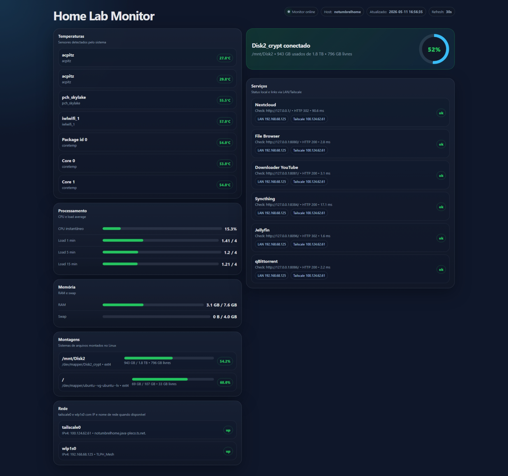

# Homelab Monitor Dashboard

Dashboard web local para monitorar indicadores básicos de um servidor Linux/home lab.

O programa coleta informações diretamente do sistema operacional e apresenta uma interface web com:

- status do disco `Disk2_crypt` / `/mnt/Disk2`;
- uso de disco e pontos de montagem relevantes;
- uso de CPU, load average, memória RAM e swap;
- status das interfaces de rede `wlp1s0` e `tailscale0`;
- IP local e IP Tailscale;
- nome da rede Wi-Fi, quando disponível;
- temperaturas detectadas pelo sistema;
- status de serviços locais;
- links de acesso aos serviços via rede interna e Tailscale.

## Serviços monitorados

Por padrão, o dashboard monitora:

| Serviço | Porta |
|---|---:|
| Nextcloud | 80 |
| File Browser | 8080 |
| Downloader YouTube | 8081 |
| Syncthing | 8384 |
| Jellyfin | 8096 |
| qBittorrent | 8086 |

O dashboard fica disponível em:

```text
http://127.0.0.1:8090
http://192.168.68.125:8090
```

## Instalação
sudo chmod +x install_service.sh
./install_service.sh

## Print screen
